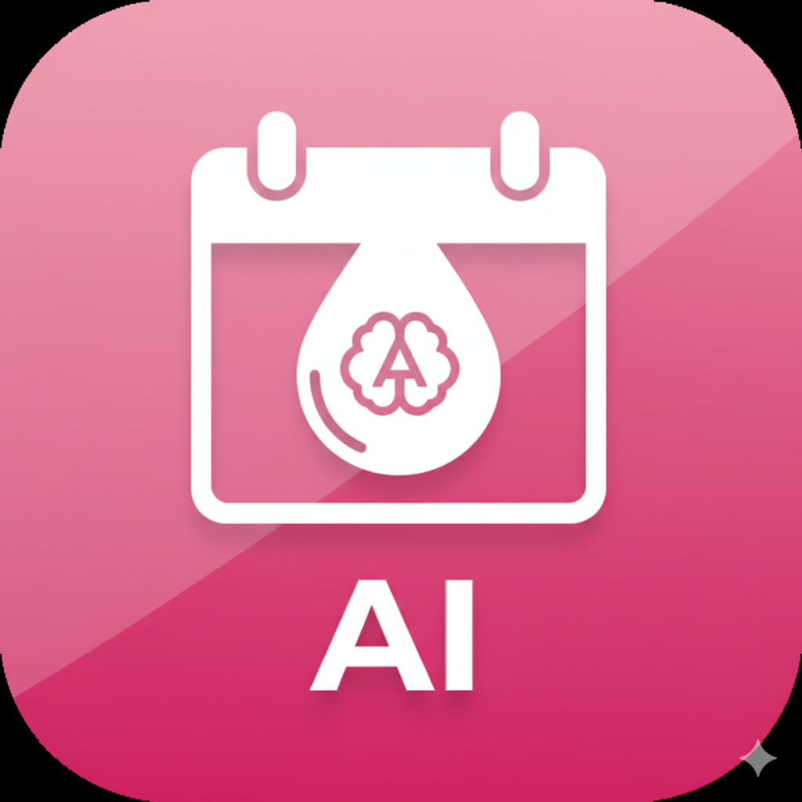

# @namanmic
# MenstruAI - Your Menstrual Health Companion


*(Note: You will need to add the `icon.png` file to your repository for this image to show)*

A comprehensive, privacy-first web application for menstrual health education and cycle tracking, featuring an integrated AI assistant.

Built with: `HTML5` `CSS3` `JavaScript` `localStorage`

## 🚀 Live Demo

*(You can add your live GitHub Pages link here after deploying)*

## 📖 Table of Contents

* [About The Project](#about-the-project)
* [Key Features](#-key-features)
* [How It Works](#️-how-it-works)
* [Tech Stack](#️-tech-stack)
* [Getting Started](#-getting-started)
* [How to Use](#-how-to-use)
* [Privacy & Data](#-privacy--data)
* [License](#-license)

## About The Project

MenstruAI is an all-in-one, browser-based companion designed to empower users with knowledge and tools to understand their menstrual cycle. It combines a detailed cycle tracker with a comprehensive educational hub and an intelligent AI assistant.

The entire application runs as a single HTML file with no external dependencies (besides the AI API), making it fast, accessible, and completely private, as all user data is stored on the user's own device.

## ✨ Key Features

### 1. Cycle Tracker
* **Log Periods:** Easily log the start date of your period.
* **Daily Log:** Track daily flow intensity, mood, physical symptoms (cramps, headache, etc.), and add personal notes.
* **Visual Calendar:** A dynamic calendar that displays logged period days, predicted future periods, fertile windows, and the estimated ovulation day.
* **Predictions:** Get quick estimates for your next period, fertile window, and ovulation day based on your cycle history.
* **Cycle Insights:** Automatically calculates and displays your average cycle length, average period length, and cycle regularity.
* **Cycle Chart:** A line graph visually represents your cycle length history, helping you spot trends and irregularities.
* **Cycle History:** A clean, scrollable list of all your past logged periods and their corresponding cycle lengths.
* **Export Data:** Download all your cycle and log data in a single JSON file for backup or personal use.

### 2. Education Hub ("Learn")
A comprehensive, tabbed interface for menstrual health education:
* **Hygiene Guide:** Best practices for hygiene, a guide to different menstrual products, and a list of warning signs that warrant a doctor's visit.
* **Symptoms & Causes:** An accordion-style guide explaining common symptoms like cramps, headaches, and PMS, along with their causes and relief methods.
* **Tips & Practices:** Actionable advice on nutrition, exercise, sleep, and stress management during your period.
* **Myths vs. Facts:** Debunks common myths about menstruation and provides factual corrections.

### 3. AI Health Assistant
* **Specialized Chatbot:** An AI assistant trained to answer questions *only* about menstrual health, hygiene, symptoms, and reproductive health.
* **Context-Aware:** Remembers the last few messages to hold a coherent conversation.
* **Safe & Focused:** Politely declines to answer questions on unrelated topics, keeping the focus on health.
* **Suggestion Chips:** Provides quick-start questions to help guide the user.

### 4. Privacy & Design
* **100% Privacy-First:** All personal data (cycle history, logs, symptoms) is stored **only** in the browser's `localStorage`. No data ever leaves your device.
* **Fully Responsive:** A clean, mobile-first design that works seamlessly on all devices, from smartphones to desktops.

## ⚙️ How It Works

This project is a single-page application (SPA) built with pure, "vanilla" JavaScript, HTML, and CSS.

* **Data Storage:** All user data is stored in `localStorage`. The app reads from and writes to `localStorage` to save periods, logs, and settings. This means all data is persistent on the user's device but is not shared with any server.
* **Cycle Logic:** All cycle calculations (predictions, averages, chart data) are performed in real-time in the browser using JavaScript `Date` objects.
* **AI Connection:** The AI Chatbot uses the `fetch` API to send a request to a placeholder API endpoint (`https://api.llm7.io/v1/chat/completions`). 
    * **Note:** This is a placeholder and not a live, public API. To use the AI chat, you would need to replace this URL and the authorization key with your own backend or a service like OpenAI, Google AI, or Anthropic.

## 🛠️ Tech Stack

* **HTML5:** Semantic HTML for structure and accessibility.
* **CSS3:** Modern CSS for styling, layout, and responsiveness.
    * CSS Variables (for theme colors)
    * CSS Grid & Flexbox (for responsive layouts)
    * Media Queries
* **Vanilla JavaScript (ES6+):**
    * DOM Manipulation
    * `localStorage` API (for all data storage)
    * `fetch` API (for AI chatbot)
    * `Canvas` API (for the cycle history chart)
    * `Date` Object (for all cycle logic and calculations)

## 🏁 Getting Started

No installation or build process is needed.

1.  **Clone the repository:**
    ```sh
    git clone [https://github.com/nksdev/menstruai.git](https://github.com/nksdev/menstruai.git)
    ```
2.  **Navigate to the directory:**
    ```sh
    cd menstruai
    ```
3.  **Open the file:**
    Simply open the `index.html` file in your favorite web browser.

## 👩‍🏫 How to Use

1.  **Log Your Period:** On the **"Tracker"** tab, find the "Log Period" section. Enter the start date of your most recent period and click "Log Period".
2.  **Add Daily Logs:** Use the "Today's Log" section to track your flow, mood, and symptoms for the current day.
3.  **View Calendar:** Check the calendar to see your logged data and future predictions.
4.  **Check Insights:** Scroll down to "Cycle Insights" and "Cycle Chart" to see your stats.
5.  **Learn:** Visit the **"Learn"** tab to read about hygiene, symptoms, and more.
6.  **Ask AI:** Go to the **"AI Chat"** tab to ask any questions you have about menstrual health.

## 🔒 Privacy & Data

This application is built with privacy as its core feature. **No personal cycle data, logs, or symptoms are ever sent to a server or seen by anyone else.** All information you enter is stored securely in your browser's `localStorage`, which only you and the script on that page can access.

If you clear your browser cache or `localStorage` for this site, your data will be permanently erased.

## 📝 License

This project is open-source and available under the MIT License.
